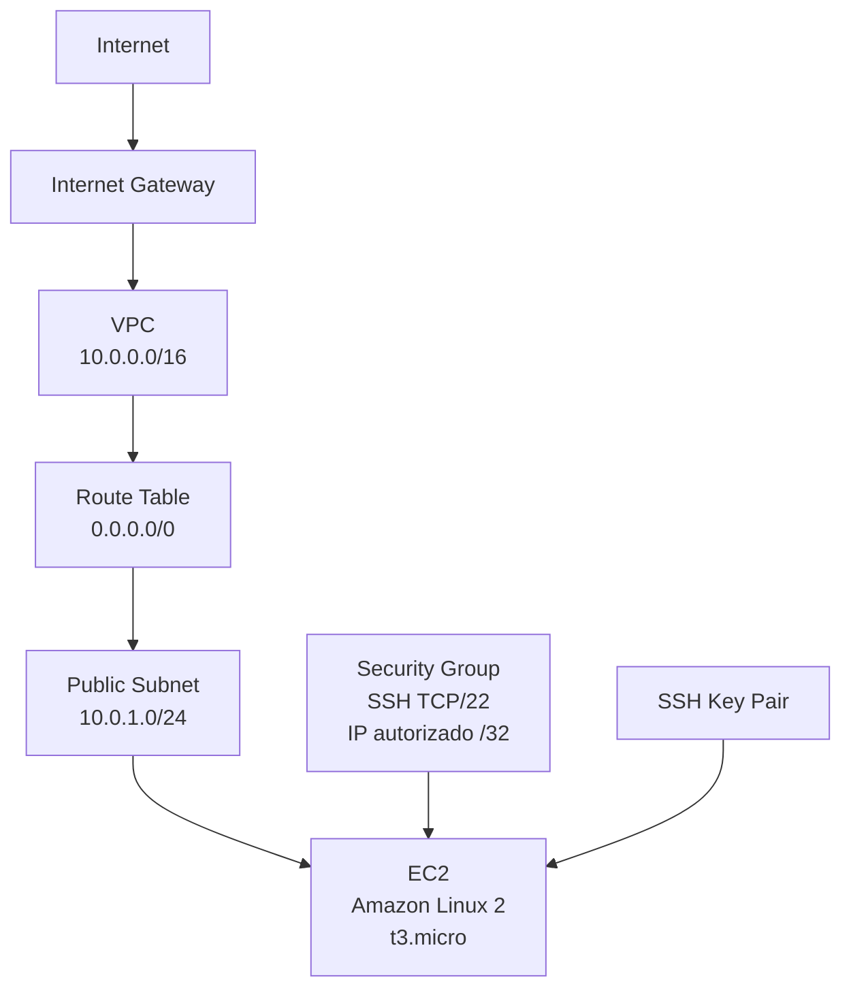

# Infraestrutura AWS com Terraform

Projeto de Infraestrutura como Código (IaC) utilizando Terraform para provisionar um ambiente de laboratório na AWS.

O projeto cria uma rede própria na AWS, uma subnet pública, acesso à internet, regras de segurança, uma chave SSH e uma instância EC2 com Amazon Linux 2.

## Objetivo

Automatizar a criação de uma infraestrutura de testes na AWS utilizando Terraform, garantindo que os recursos possam ser provisionados de forma reproduzível, versionada e controlada.

## Arquitetura



## Recursos provisionados

O Terraform gerencia os seguintes componentes:

- VPC com CIDR `10.0.0.0/16`;
- subnet pública com CIDR `10.0.1.0/24`;
- Internet Gateway;
- Route Table com rota padrão `0.0.0.0/0`;
- associação da Route Table à subnet pública;
- Security Group permitindo SSH na porta `22` somente a partir do IP autorizado;
- regras de entrada e saída do Security Group;
- AWS Key Pair criada a partir de uma chave pública local;
- consulta automática da AMI Amazon Linux 2;
- instância EC2;
- outputs com IDs, IP público e comando de acesso SSH.

## Tecnologias

- Terraform
- AWS
- Amazon EC2
- Amazon VPC
- AWS IAM
- OpenSSH
- Git

## Estrutura do projeto

```text
.
├── .gitignore
├── .terraform.lock.hcl
├── main.tf
├── outputs.tf
├── providers.tf
├── terraform.tfvars.example
├── variables.tf
├── versions.tf
└── README.md
```

Arquivos locais como `terraform.tfvars`, `terraform.tfstate`, planos Terraform e a pasta de evidências não são versionados.

## Pré-requisitos

É necessário possuir:

- Terraform instalado;
- AWS CLI instalada;
- Git;
- OpenSSH;
- conta AWS;
- usuário IAM autorizado;
- autenticação válida na AWS CLI;
- par de chaves SSH local.

Neste projeto a autenticação da AWS é feita por credenciais temporárias, sem armazenar Access Key ou Secret Access Key no código Terraform.

## Configuração

Crie o arquivo local de variáveis a partir do exemplo:

```powershell
Copy-Item terraform.tfvars.example terraform.tfvars
```

Edite `terraform.tfvars` e informe os valores do ambiente.

Exemplo:

```hcl
aws_region         = "us-east-1"
vpc_cidr           = "10.0.0.0/16"
public_subnet_cidr = "10.0.1.0/24"

instance_type = "t3.micro"

ssh_cidr = "SEU_IP_PUBLICO/32"

key_pair_name       = "terraform-lab"
ssh_public_key_path = "~/.ssh/terraform-lab.pub"
```

O acesso SSH deve utilizar um endereço `/32`, evitando liberar a porta `22` para toda a internet.

## Autenticação AWS

O perfil AWS utilizado localmente pode ser definido no PowerShell:

```powershell
$env:AWS_PROFILE="terraform-lab"
```

A identidade pode ser conferida com:

```powershell
aws sts get-caller-identity
```

Credenciais AWS não são armazenadas nos arquivos Terraform.

## Inicialização

Inicialize o projeto:

```powershell
terraform init
```

Formate e valide a configuração:

```powershell
terraform fmt
terraform validate
```

## Planejamento

Antes de criar qualquer recurso:

```powershell
terraform plan
```

Para salvar um plano:

```powershell
terraform plan -out=tfplan
```

O plano deve ser revisado antes da aplicação.

## Provisionamento

Aplique um plano previamente revisado:

```powershell
terraform apply tfplan
```

Após a criação, os principais dados podem ser consultados com:

```powershell
terraform output
```

## Acesso SSH

O Terraform fornece o comando de acesso através do output `ssh_command`.

Também é possível consultar diretamente:

```powershell
terraform output -raw ssh_command
```

O usuário padrão da Amazon Linux 2 utilizado no projeto é:

```text
ec2-user
```

## Validação

Após o provisionamento foi validado:

```bash
cat /etc/os-release
hostname
hostname -I
uname -m
```

A instância provisionada apresentou:

```text
Amazon Linux 2
IP privado dentro da rede 10.0.1.0/24
Arquitetura x86_64
```

Após a criação completa da infraestrutura, um novo:

```powershell
terraform plan
```

retornou:

```text
No changes. Your infrastructure matches the configuration.
```

Isso demonstra que o estado do Terraform está sincronizado com a infraestrutura provisionada.

## Observação sobre o tipo da instância

O exercício originalmente especificava uma instância `t2.micro`.

Durante o provisionamento, a API da AWS retornou que `t2.micro` não era elegível ao Free Tier para a conta utilizada.

A elegibilidade foi consultada diretamente pela AWS CLI e `t3.micro` estava entre os tipos `x86_64` elegíveis.

Por esse motivo, o projeto utiliza:

```text
t3.micro
```

mantendo o objetivo de executar o laboratório dentro das opções elegíveis ao Free Tier disponíveis para a conta.

A instância T3 também foi configurada com:

```text
cpu_credits = standard
```

## Amazon Linux 2

A AMI não é definida através de um ID fixo.

O Terraform utiliza um Data Source para localizar uma imagem Amazon Linux 2 publicada pela Amazon e compatível com arquitetura `x86_64`.

Isso evita vincular o projeto a um AMI ID específico de uma região.

O Amazon Linux 2 foi utilizado porque é o sistema operacional solicitado no exercício.

## Segurança

O projeto aplica algumas práticas básicas de segurança:

- acesso SSH permitido somente para um endereço IPv4 `/32`;
- ausência de Access Key e Secret Access Key no código;
- chave privada SSH mantida apenas no computador local;
- somente a chave pública é enviada à AWS;
- IMDSv2 obrigatório na EC2;
- arquivos de state não são versionados;
- `terraform.tfvars` não é versionado;
- planos Terraform não são versionados;
- autenticação AWS realizada com usuário IAM, e não com root.

## Arquivos ignorados pelo Git

O `.gitignore` impede o versionamento de informações locais como:

```text
.terraform/
terraform.tfstate
terraform.tfstate.backup
terraform.tfvars
tfplan
image/
```

O arquivo `.terraform.lock.hcl` é versionado para manter a versão resolvida do provider consistente entre execuções.

## Destruição da infraestrutura

Ao finalizar o laboratório, os recursos devem ser removidos para evitar utilização desnecessária da conta AWS.

Primeiro revise:

```powershell
terraform plan -destroy
```

Depois execute:

```powershell
terraform destroy
```

Somente confirme a destruição após verificar os recursos que serão removidos.

## Conceitos praticados

Este projeto demonstra na prática conceitos de:

- Infrastructure as Code;
- configuração declarativa;
- Terraform State;
- Terraform Providers;
- Resources;
- Data Sources;
- Variables;
- Outputs;
- dependências entre recursos;
- idempotência;
- redes AWS;
- controle de acesso;
- automação de infraestrutura;
- versionamento com Git.